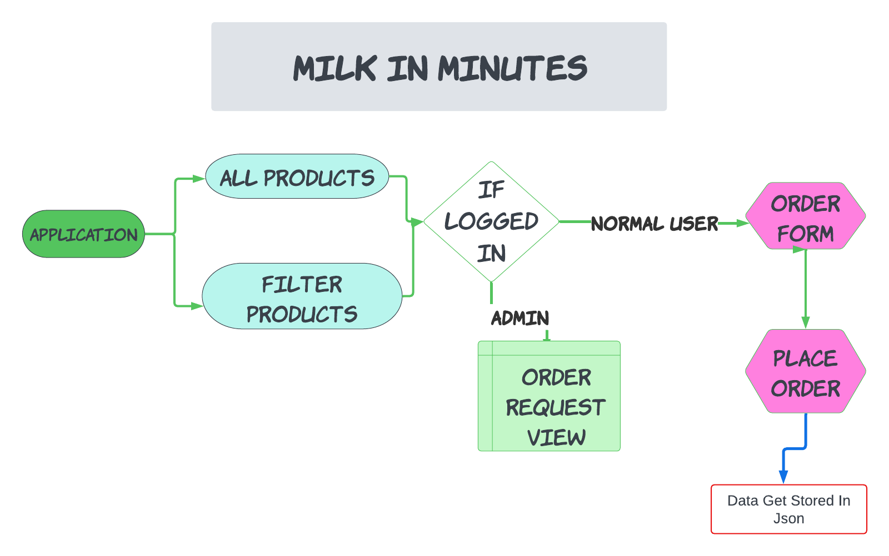

# Milk In Minutes

Milk In Minutes is a web application designed to help users quickly find and order dairy products online. The application provides a seamless shopping experience with an intuitive interface and fast delivery service.

## Features
- User authentication and profile management
- Order Request Feature
- Browse various dairy products like milk, cheese, yogurt, and more using dyanmic search

## Tech Stack
- Angular ( Main FrontEnd Framework )
- Html
- CSS
- JavaScript
- BootStrap
- Json Files

## Overview Video
https://www.loom.com/share/5e6c9a090bff498e8e1c477e9e4b22b1?sid=0ac7837e-e345-4fc1-b22f-f29eb89fe6f0

## Project Flow


## Screenshots


## Installation
To run this project locally, follow these steps:

1. **Clone the repository:**
   ```sh
   git clone https://github.com/avishmadaan/milkinminutes.git
   
2. **Navigate to the project directory:**
    ```sh
   cd milkinminutes

3. **Install dependencies**
    ```sh
    npm install

4. **Start the development server:**
    ```sh
   ng serve

5. **Navigate to the json directory**
    ```sh
   json-server products.json -p 5000 & json-serve orderRequests -p 3001

6. **Run your project on:**
```sh
   http://localhost:4200

